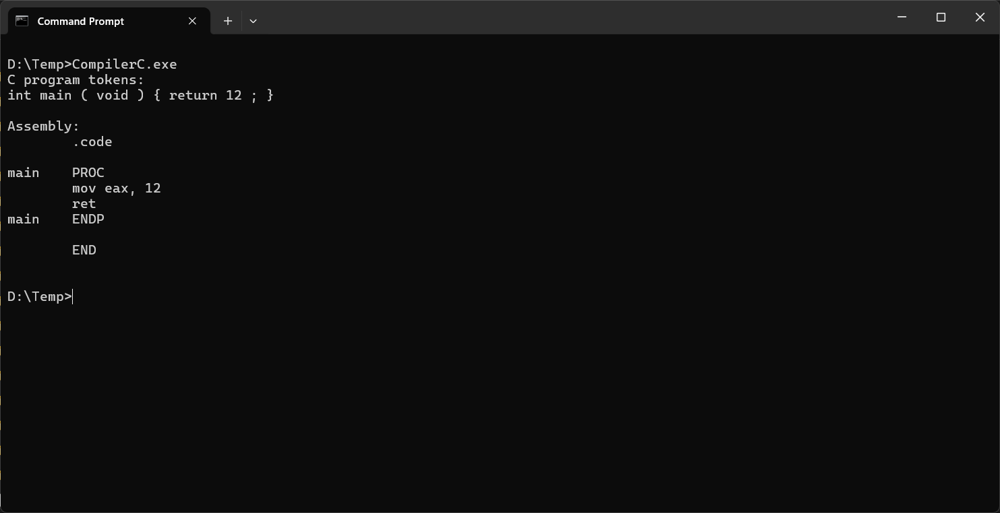

## Compiler C

The very basic C compiler for fun and education written in C++.  
It's just a starting point.

It mostly based on Nora Sandler's "Writing a C Compiler" and Robert Nystrom's "Crafting Interpreters".

## How it works
For now can compile just a simple main function with return statement.

1. Tokenizes source code with regexps.
2. Recursive descent parser builds an AST for C.
3. Then we build an AST for Assembly representation.
3. Finally we walk through Assembly AST and generate Assembly instructions compatible with MASM.

To build exe from output assembly file run `masm_build.bat`.  
[!NOTE]
You have to have Visual Studio installed so `x64 Native Tools Command Prompt` is available.
You can either to run `x64 Native Tools Command Prompt` and then locate and run `masm_build.bat`
or you can just locate ml64.exe and add it's directory to Path so you can run `masm_build.bat` from anywhere.